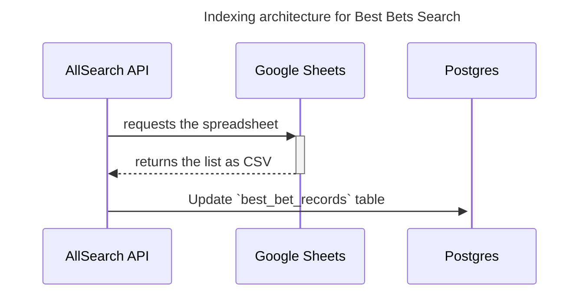

### Best bets search architecture

PUL staff maintain a list of best bets in a Google spreadsheet.
We use the following architecture to make these best bets
searchable in allsearch-api.

#### Indexing architecture

The AllSearch API's searchable list of best bets is created
and updated by these steps,
as illustrated in the diagram below:

1. The AllSearch API server regularly requests
a copy of the best bets spreadsheet as a CSV from
Google Sheets.
1. Allsearch API updates the `best_bet_records` database table using information from the CSV.

