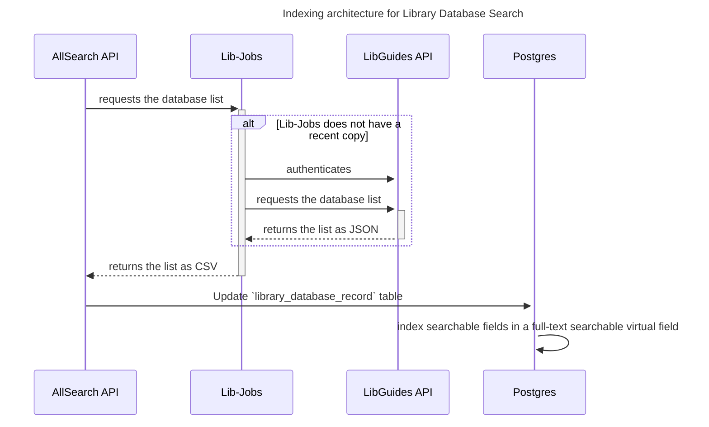

### Library database search architecture

At time of writing, the Libguides API does not offer a way for
client applications to search library databases.  Therefore, we
use the following architecture to allow users to search these
library databases.

#### Indexing architecture

See also [Web database list job in lib-jobs](https://github.com/pulibrary/lib_jobs/tree/main/docs/web_database_list).

The AllSearch API's searchable list of library
databases is created and updated by these steps,
as illustrated in the diagram below:

1. The AllSearch API server regularly requests
a copy of the database list from Lib-Jobs.
1. If Lib-Jobs has a recent copy of the database
list, it simply returns it.  If not:
    1. Lib-Jobs authenticates to the LibGuides API.
    1. Lib-Jobs requests the library database list from the LibGuides API.
    1. The LibGuides API returns the library database list as JSON.
    1. Lib-Jobs converts the API response to CSV and returns it to the AllSearch API.
1. Allsearch API updates the `library_database_record` database table using information from the CSV.
1. Postgres adds a tsvector representation of the
searchable fields into a [full-text searchable](https://www.postgresql.org/docs/current/textsearch.html)
virtual field.

