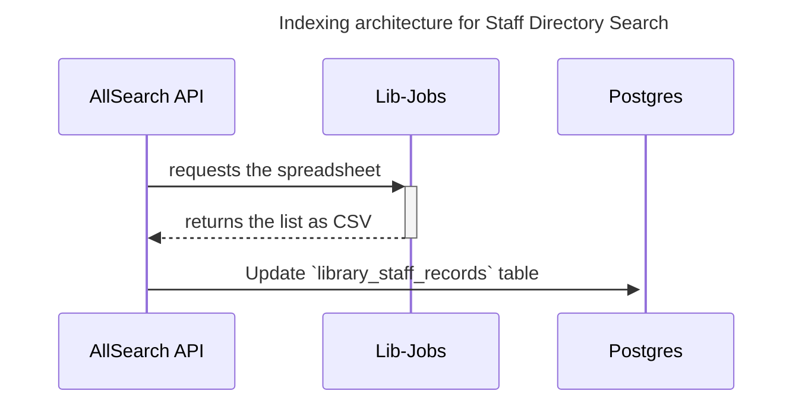

### Staff Directory search architecture

PUL maintains a directory of all staff members that is processed into a CSV file by lib-jobs

We use the following architecture to make staff directory
searchable in allsearch-api.

#### Indexing architecture

The AllSearch API's searchable list for the Staff directory is created
and updated by these steps,
as illustrated in the diagram below:

1. The AllSearch API server regularly requests
a copy of the staff directory spreadsheet as a CSV from
lib-jobs.
1. Allsearch API updates the `library_staff_records` database table using information from the CSV.

